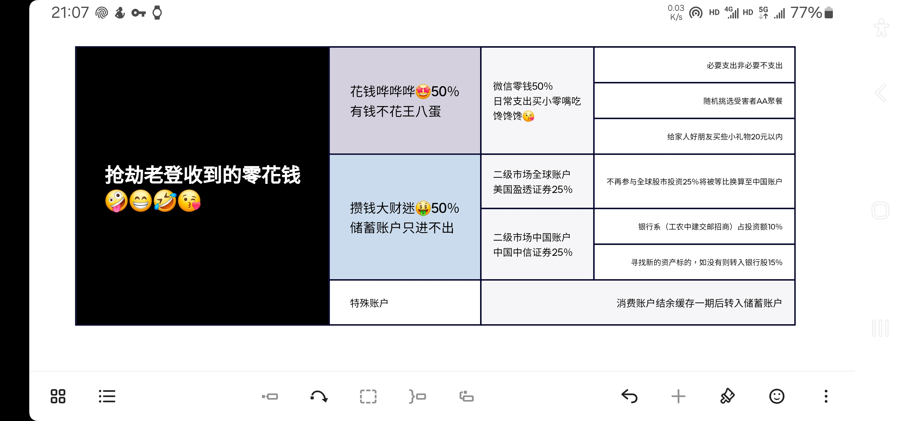
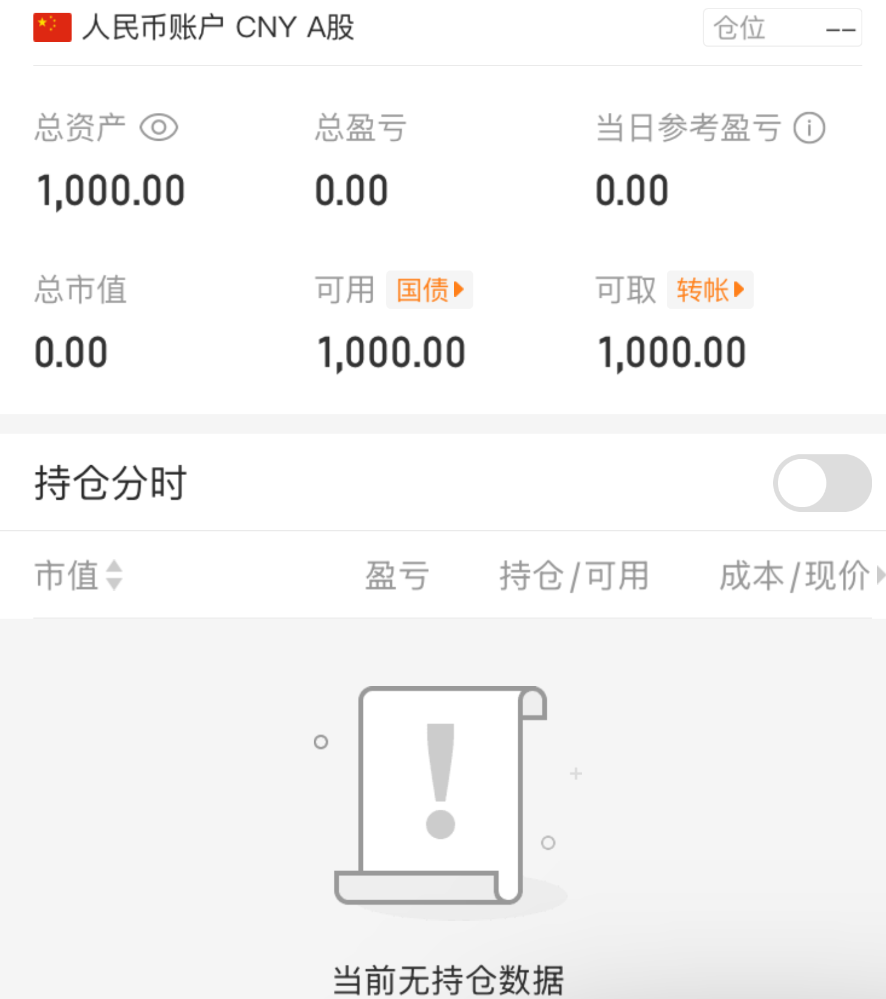

# Stocks Investment Tracker Book

* 公布个人持仓调整报告，每月捐赠当期投资利润的10%。
* 全球投资账户：美国盈透证券。
* 国内投资账户：中国中信证券。

## 我如何分配我的收入？

## 202504

* 交通银行分红派息扣除税后19.80CNY，剩下两个投机赚差价。本期收益率15%，扣税后获利116.37CNY。（本期收入捐赠已兑现）

## 202503

* 本金紧张，暂无投资打算。

